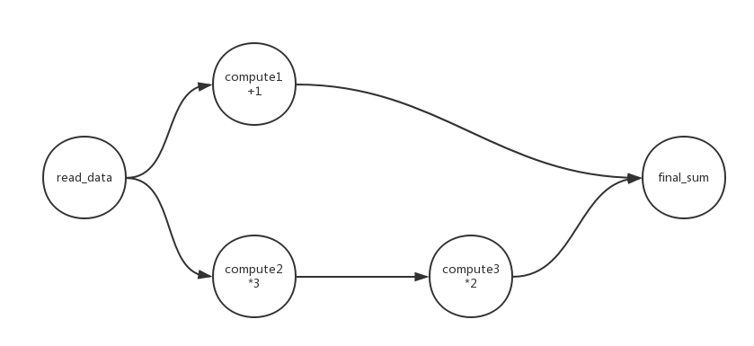

# DAG流处理模块

## 背景

分布式流式处理的作业拓扑常常使用DAG图来进行表示，这样做能够清晰的描述出数据流之间的处理逻辑，也有助于代码的拓展和维护。本模块主要用于新闻文字处理，通过DAG图来描述新闻流信息的处理流程和逻辑。

## 源码结构
```shell
DAGFlow/
|---__init__.py
|---DAG.py 			# DAG类
|---main.py
    Operator/			# 对应不同的运算，定义不同的操作类
    |---TextOperator.py		# 应对文字处理的操作类
    |---__init__.py
    scripts/ 			# 存放测试脚本
    |---__init__.py
    |---demo.py
```

## 使用说明

- 创建DAG图的实例
    ```python
    dag = DAG("test1")
    ```

- 创建运算实例
    ```python
    def compute1(data, **kwargs):
        output = data + 1
        return output

    t1 = TextOperator("compute1",  # 该运算节点的唯一标示符
                      dag,         # DAG图实例
                      compute1)    # 该节点的运算函数
                                   # 还可以继续添加其他参数，
                                   # 在执行运算时，额外的参数会被传到运算函数
    ```

- 建立运算节点间的关系
    ```python
    t1.set_upstream([t2, t3])
    ```

- 根节点初始化
    ```python
    dag.root_init('compute1', 50)
    ```

- 执行DAG实例
    ```python
    dag.run()
    ```


## 使用样例

- 样例需要实现的运算公式

    ```
    f(x) = (data + 1) + data*3*2
    ```

- 公式的计算流程图

    

- demo.py代码

    ```python
    #coding=utf-8
    import sys
    sys.path.append("..")
    from DAG import DAG
    from Operator.TextOperator import TextOperator

    def demo1():
        # 初始化DAG图
        dag = DAG("test1")

    def read_data(data):
        print("Start")
        print("Input: %s" % str(data))
        print("--------")
        return data

    def compute1(data):
        print("Running compute1")
        output = data + 1
        print("output: %s" % str(output))
        print("--------")
        return output

    def compute2(data):
        print("Running compute2")
        output = data * 3
        print("output: %s" % str(output))
        print("--------")
        return output

    def compute3(data):
        print("Running compute3")
        output = data * 2
        print("output: %s" % str(output))
        print("--------")
        return output

    def final_sum(data):
        print("final result:")
        print(data[0] + data[1])

    
    # 初始化运算单元
    t1 = TextOperator("read_data", dag, read_data)

    t2 = TextOperator("compute1", dag, compute1)

    t3 = TextOperator("compute2", dag, compute2)

    t4 = TextOperator("compute3", dag, compute3)

    t5 = TextOperator("final_sum", dag, final_sum)

    # 建立运算节点的层级关系
    t1.set_upstream([t2, t3])
    t2.set_upstream(t5)
    t3.set_upstream(t4)
    t4.set_upstream(t5)

    # 输入数据到根节点
    dag.root_init('read_data', 50)

    # 执行DAG图
    dag.run()
    ```
- 输出结果
    ```python
    Start
    Input: 50
    --------
    Running compute1
    output: 51
    --------
    Running compute2
    output: 150
    --------
    Running compute3
    output: 300
    --------
    Final Result:
    351
    ```
